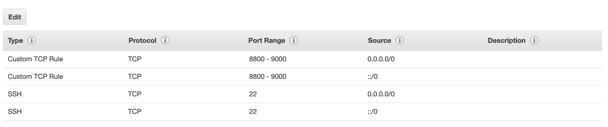

# Freebase-SPARQL-server-on-AWS
Tutorial on Freebase SPARQL server setup using AWS instance

## Intro
As Freebase was shutdown in 2015, very few resource about Freebase cannot be found on the Internet. But for those who are interested in sementic parsing or KBQA (question answering over knowledge bases), having a Freebase sparql server (something like the one used by Wikidata [https://query.wikidata.org/](https://query.wikidata.org/) or DBpedia [https://dbpedia.org/sparql](https://dbpedia.org/sparql)) at hand can really relieve your headache. It can be used to explore the KB and also annotate new dataset. I myself have experience following some of the existing tutotials, i.e., [sempre](https://github.com/percyliang/sempre/blob/master/TUTORIAL.md), [this](http://sivareddy.in/load-freebase-dump-into-virtuoso-sparql-sql) and [this](https://github.com/sameersingh/nlp_serde/wiki/Virtuoso-Freebase-Setup). However, they are either out of date (older Freebase version or older Virtuoso that requries out-of-data openssl) or incomplete. After some trials and errors, I found a simple pipleline that works well and that's what this tutorial is about. For those who are mostly in NLP and do not have lots of experience on Virtuoso and SPARQL like me, this tutotail might be a good start point. 

## Why AWS and which instance to choose
Freebase is huge! You need a machine that has around 300GB RAM. If you don't to want use the server constantly, AWS might be the cheapest solution. Make sure you select an instance that has enough RAM and storage. I used r5.12xlarge with additional SSD storage and Ubuntu 18.04 AMI.

**Before your launch your instance, make sure your modify the Security Group rule so that the SPARQL server can be access with your browser, the inbound rule should be something like below:**

## Instructions
* After log in to your instance, install Virtuoso following [http://vos.openlinksw.com/owiki/wiki/VOS/VOSUbuntuNotes](http://vos.openlinksw.com/owiki/wiki/VOS/VOSUbuntuNotes)
* Download Freebase dump from [https://developers.google.com/freebase/](https://developers.google.com/freebase/)
* Create a folder for database: `mkdir db && mv freebase-rdf-* db`, unzip the dump: `cd db && gunzip freebase-rdf-*`
* Copy the default configuration file for the database folder: 'cp /etc/virtuoso-opensource-6.1/virtuoso.ini .'
* Modify `virtuoso.ini` to increase the buffer size according to your system memory
* Run a virtuoso server: `virtuoso-t -f`, make sure you are in the database folder that has `virtuoso.ini`
* Run a client: `isql-vt`
  * add the dump path: `SQL> ld_dir('.', 'freebase-rdf-*', 'http://freebase.com');`
  * load the Freebase dump: `SQL> rdf_loader_run();`, this will take a very long time
  * during loading, you can create another client in another screen and check how many triples have been loaded:
    * `isql-vt`
    * `SQL> SPARQL SELECT ?g COUNT(*) { GRAPH ?g {?s ?p ?o.} } GROUP BY ?g ORDER BY DESC 2;`
    
 After loading, you will be able to access the SPARQL endpoint via your local brower:
 * First find the **IPv4 Public IP** of your AWS instance from the AWS console
 * Access the endpoint via [http://instanceIP:8890/sparql](http://instanceIP:8890/sparql)
